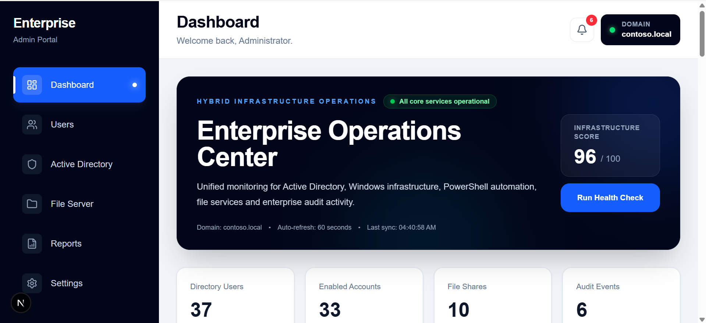
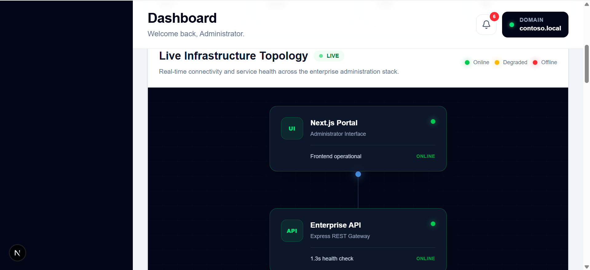
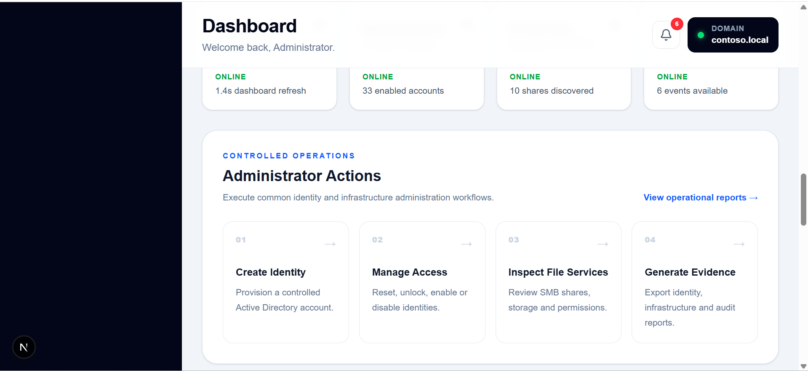
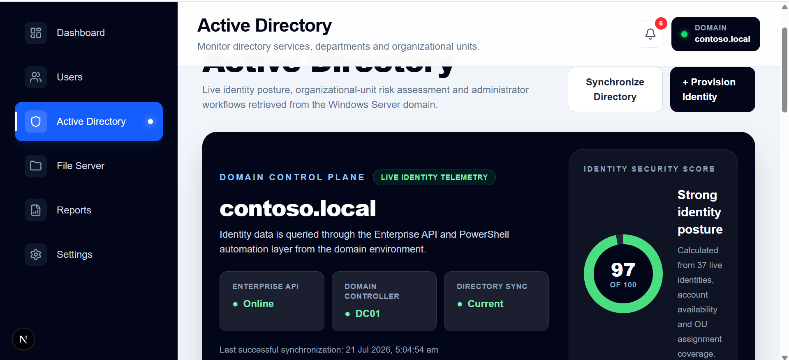
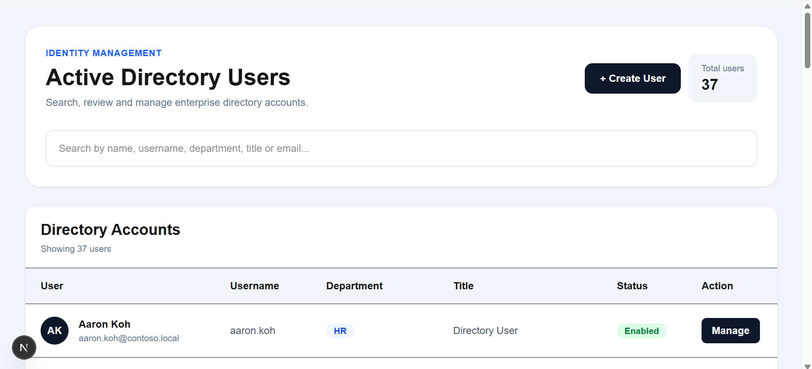
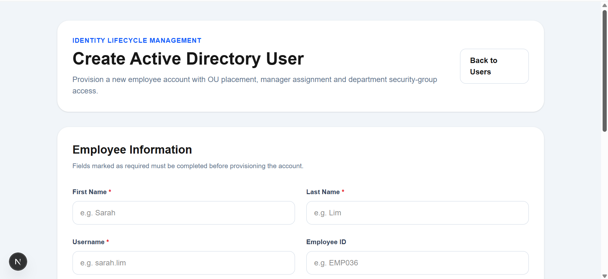

# Enterprise Infrastructure Management Platform

Enterprise-grade infrastructure administration platform built with **Next.js**, **TypeScript**, **Express.js**, **Windows Server 2022**, **Active Directory**, and **PowerShell Automation**.

The platform simulates an internal enterprise administration portal used by Infrastructure Engineers to manage Active Directory identities, Windows Server resources, SMB file services, operational reporting, and infrastructure monitoring from a modern web interface.

---

## Enterprise Overview

Modern enterprise environments often require administrators to work across multiple Microsoft Management Consoles, PowerShell terminals, and server interfaces.

This project centralizes those administration tasks into a single dashboard that provides:

- Active Directory administration
- Windows Server management
- Infrastructure monitoring
- SMB File Server management
- PowerShell automation
- Administrative reporting
- Identity operations

The project was developed using a Windows Server laboratory environment to demonstrate practical enterprise infrastructure engineering.

---

# Screenshots

## Enterprise Operations Center



---

## Live Infrastructure Topology



---

## Administrator Actions



---

## Active Directory Operations



---

## Directory User Management



---

## User Provisioning



---

## SMB File Services


---

## Administrative Reports


---

## Platform Configuration


---

# Features

## Enterprise Dashboard

- Enterprise Operations Center
- Infrastructure health monitoring
- Service availability monitoring
- Department analytics
- Infrastructure topology
- Administrative notifications
- Identity statistics
- Operational metrics
- Infrastructure status monitoring

---

## Active Directory

- View directory users
- Create new users
- Enable accounts
- Disable accounts
- Unlock accounts
- Reset passwords
- Department assignment
- Organizational Unit management
- Identity monitoring

---

## File Server

- SMB Share discovery
- Windows Server integration
- Storage statistics
- Share monitoring
- File service overview

---

## Reports

- Administrative audit logs
- Operational reporting
- Infrastructure summaries
- Administrative activity
- Evidence generation

---

## Settings

- Environment configuration
- Infrastructure information
- System configuration
- Refresh controls

---

# Enterprise Architecture

```text
                     Next.js Administration Portal
                                  │
                                  ▼
                        Express REST API
                                  │
                                  ▼
                    PowerShell Automation Layer
                                  │
                                  ▼
                       Windows Server 2022
                                  │
                   ┌──────────────┴──────────────┐
                   ▼                             ▼
          Active Directory              SMB File Services
```

---

# Technology Stack

## Frontend

- Next.js (App Router)
- React
- TypeScript
- Tailwind CSS

---

## Backend

- Express.js
- REST APIs
- JSON APIs

---

## Infrastructure

- Windows Server 2022
- Active Directory Domain Services
- PowerShell
- SMB File Server
- Windows Administration

---

## Development

- Visual Studio Code
- Git
- GitHub

---

# Project Structure

```text
app/
├── api/
├── components/
├── users/
├── active-directory/
├── file-server/
├── reports/
├── settings/

docs/

public/
└── images/
    ├── dashboard/
    ├── active-directory/
    ├── users/
    ├── file-server/
    ├── reports/
    └── settings/

README.md
CHANGELOG.md
SECURITY.md
CONTRIBUTING.md
LICENSE
```

---

# Getting Started

Clone the repository

```bash
git clone https://github.com/Ramya-cloud-tech/enterprise-infrastructure-management-platform.git
```

Install dependencies

```bash
npm install
```

Start the application

```bash
npm run dev
```

Open

```
http://localhost:3000
```

> **Note:** Administrative operations require a configured Windows Server laboratory environment with Active Directory, PowerShell automation, and the Express.js backend services.

---

# Skills Demonstrated

- Enterprise Infrastructure Administration
- Active Directory Administration
- Windows Server Administration
- Identity Management
- PowerShell Automation
- REST API Development
- Full-Stack Web Development
- Infrastructure Monitoring
- SMB File Server Administration
- Enterprise Dashboard Development
- Next.js
- React
- TypeScript
- Git Version Control

---

# Future Improvements

- Azure Active Directory Integration
- Microsoft Graph API
- Role-Based Access Control (RBAC)
- Multi-Factor Authentication (MFA)
- Docker Deployment
- CI/CD Pipelines
- Azure Deployment
- SQL Server Integration
- Email Notifications
- Live Infrastructure Monitoring
- Remote Server Administration

---

# Repository Contents

| Document | Purpose |
|----------|---------|
| README.md | Project documentation |
| CHANGELOG.md | Version history |
| SECURITY.md | Security policy |
| CONTRIBUTING.md | Contribution guidelines |
| LICENSE | MIT License |

---

# Disclaimer

This project was developed for educational and portfolio purposes using a Windows Server laboratory environment.

It demonstrates enterprise infrastructure engineering concepts including Active Directory administration, Windows Server management, PowerShell automation, SMB File Server administration, REST API development, and modern full-stack application architecture.

The project does not connect to or manage any production enterprise infrastructure.